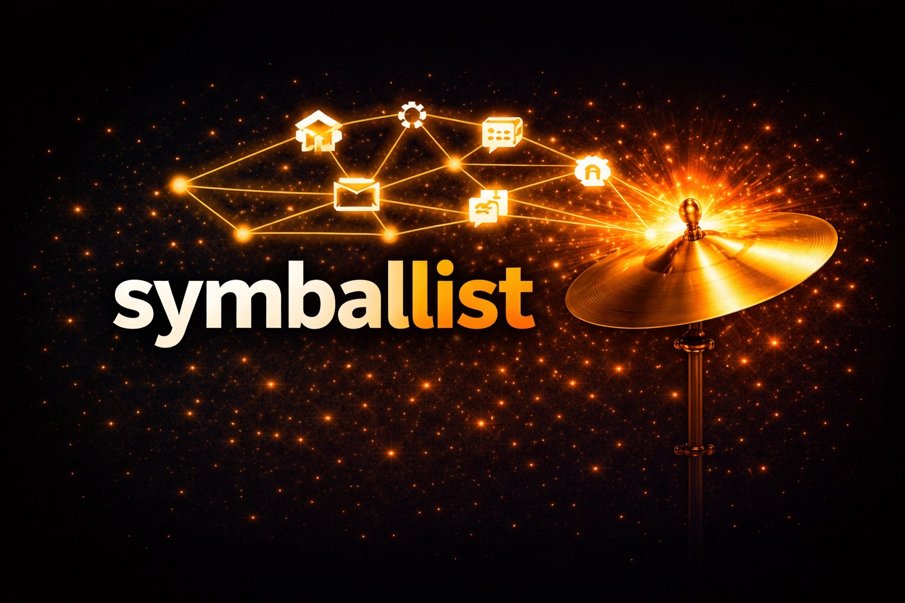

# symballist



`symballist` is a local-first retrieval tool for AI agents. It indexes a repository into symbols, docs, search metadata, and lightweight relations so agents can find useful code and project context faster than plain text search alone.

It is designed to stay:

- local-first
- CLI-reliable
- agent-friendly
- explicit about freshness and fallbacks

## What It Can Do Today

`symballist` currently supports:

- Python
- HTML
- Markdown
- JavaScript
- TypeScript
- YAML
- shell / bash / zsh
- Dockerfile / Containerfile
- CSS
- symbol-first retrieval with file-level fallbacks
- spans, snippets, and full-symbol lookup
- stale-index detection and lightweight change awareness
- automatic foreground watch-based refresh
- optional Ollama embeddings with hybrid lexical + semantic retrieval
- one-hop graph-aware reranking using containment/import neighborhoods
- lightweight follow-up context through relations and related symbols
- repo-local downstream agent bootstrap during `init`
- configurable downstream setup modes for CLI, tool, or hybrid integration

## Quick Install

### Prerequisites

- [Bun](https://bun.sh/)
- optionally [Ollama](https://ollama.com/) if you want embeddings

From the repo root:

```powershell
bun install
```

If Bun reports blocked lifecycle scripts for the tree-sitter packages, inspect them with:

```powershell
bun pm untrusted
```

If you trust those packages, run:

```powershell
bun pm trust tree-sitter tree-sitter-html tree-sitter-python
```

If you want a globally callable command while developing locally:

```powershell
bun link
```

That exposes `symballist` from this checkout. If you do not want a global link, you can still run it with:

```powershell
bun run src/cli.ts --help
```

## Fastest Setup In A Target Repo

If you already ran `bun link` from this checkout, the simplest way to try `symballist` on another local project is from that target repo root:

```powershell
symballist init --setup-type hybrid
symballist index
symballist lookup "your query here"
```

After `init`, the target repo gets:

- `.symballist/` repo-local state
- local wrapper commands in `.symballist/bin/`
- generated tool definitions in `.symballist/tools/` for `tool` or `hybrid` setups
- adoption docs in `.symballist/instructions/`
- managed `AGENTS.md` / `CLAUDE.md` retrieval blocks
- a `.gitignore` entry for `.symballist/`

Available setup types:

- `hybrid`
  - default
  - prefers generated tool definitions with CLI fallback
- `tool`
  - writes tool-definition assets and slimmer tool-first guidance
- `cli`
  - skips tool-definition assets and keeps the integration CLI-only

Current language coverage:

- code and app structure: Python, JavaScript, TypeScript, HTML
- docs: Markdown
- config and ops: YAML, shell / bash / zsh, Dockerfile / Containerfile, CSS

If you are not using a linked global command, the repo-local wrappers are the portable fallback:

```bash
./.symballist/bin/symballist status --root <PROJECT_ROOT>
```

On Windows, use the cmd wrapper instead:

```powershell
.symballist\bin\symballist.cmd status --root <PROJECT_ROOT>
```

If you are invoking `symballist` from outside the target repo root, pass `--root <PROJECT_ROOT>` explicitly.

## 60-Second Workflow

Once `init` and `index` have completed successfully, setup is effectively done. Typical day-to-day usage from the target repo root looks like this:

```powershell
symballist status
symballist lookup "memory store"
symballist show --name MemoryStore
```

If you are actively developing and want the index to stay warm, run a foreground watch loop while you work:

```powershell
symballist watch --interval-ms 2000
```

For agents, `watch --once` is usually the safer automatic-refresh step:

```powershell
symballist watch --once
```

## Core Commands

- `symballist init`
  - bootstraps repo-local state and downstream agent instructions
  - supports `--setup-type cli|tool|hybrid`
- `symballist index`
  - performs a full incremental-aware index pass
- `symballist watch --once`
  - does a one-shot freshness sweep and reindex if needed
- `symballist watch --interval-ms 2000`
  - keeps a foreground polling loop alive
- `symballist status`
  - shows index health, freshness, change awareness, embeddings state, and shell-aware entrypoint guidance
- `symballist query "<text>"`
  - exploration flow: returns ranked candidates when you want to inspect multiple hits
- `symballist lookup "<text>"`
  - best-match flow: returns the selected hit plus resolved symbol context and alternatives
- `symballist show <id>`
  - inspection flow: resolves a known result id into stored context
- `symballist show --name <symbol>`
  - resolves an exact symbol name without needing an intermediate id
- `symballist show --name <symbol> --full`
  - expands large bodies instead of returning the summarized default
- `bodyPresentation`
  - `lookup` and `show` summarize oversized bodies by default; check `bodyPresentation.fullerBodyAvailable` and `bodyPresentation.expansionHint` to decide whether `--full` is worth the extra payload
- `--compact`
  - trims repeated legend and semantics blocks from `query`, `lookup`, and `show` for cheaper agent consumption

## Useful Query Controls

For code-heavy retrieval:

```powershell
symballist query "gateway config api live reload" --code-only --exclude-tests --prefer-implementation --root <PROJECT_ROOT>
```

For doc-heavy retrieval:

```powershell
symballist query "memory management" --docs-only --root <PROJECT_ROOT>
```

For tighter symbol types:

```powershell
symballist query "AgentConfig" --kind class,function --root <PROJECT_ROOT>
```

## Retrieval Model

The current retrieval stack is:

1. lexical search
2. optional semantic retrieval through local embeddings
3. hybrid fusion
4. one-hop graph-aware reranking
5. bounded follow-up context through relations and related symbols

Important behavior:

- exact lexical hits still win when they should
- weak conceptual queries can now be lifted by semantic retrieval
- ambiguous nearby code results can be nudged by one-hop graph signals
- if embeddings are unavailable, the system falls back cleanly to lexical retrieval
- if parsing fails, the system falls back to file-level units instead of failing closed

## Output Semantics

`query` and `lookup` expose several fields that are useful for debugging or agent behavior:

- `indexFreshness`
  - whether the indexed repo is stale relative to the filesystem
- `changeAwareness`
  - file-level change summaries since index and, when available, since `git HEAD`
- `graphAwareness`
  - bounded likely-root hints plus advisory possible-orphan candidates derived from the indexed graph; these are meant for navigation and cleanup review, not dead-code claims
- `shellGuidance`
  - the best local wrapper to use for the current shell plus shell-specific alternatives
- `retrieval.mode`
  - `lexical` or `hybrid`
- `retrieval.hybrid`
  - semantic candidate counts and top semantic-candidate diagnostics
- `confidence`
  - `exact`, `strong`, `related`, or `fallback`
- `trustLevel`
  - extraction trust
- `retrievalTrustLevel`
  - retrieval-match trust
- `retrievalChannels`
  - whether a result came from lexical, concept-path, semantic, or a combination
- `hybridContribution`
  - whether semantic retrieval actually contributed
- `graphSignals`
  - one-hop graph-aware reranking hints such as `same_file_cluster`, `imports_candidate`, `imported_by_candidate`, `uses_candidate`, `used_by_candidate`, and `root_candidate`
- `graphDiagnostics`
  - index-bounded structural diagnostics on returned symbols/results, such as no known inbound references, test-only inbound references, same-file-only connectivity, disconnected-from-indexed-graph, root-like status, and possible-orphan candidacy

If you want a cheaper response for agent consumers, use `--compact` to keep the retrieval payload while omitting the repeated legend / semantics blocks.

## Optional Embeddings

Embeddings are opt-in and local-first. Current provider support starts with Ollama.

They are disabled by default after `init`. Enable them by editing `.symballist/config.json` in the target repo:

```json
{
  "embeddings": {
    "enabled": true,
    "provider": "ollama",
    "baseUrl": "http://localhost:11434",
    "model": "nomic-embed-text:latest",
    "dimensions": null
  }
}
```

Because `.symballist/` is gitignored, config changes here will not appear in `git diff`.

Current behavior:

- embeddings are generated during `index`
- changed files naturally refresh vectors on reindex
- `query` and `lookup` automatically use hybrid retrieval when vectors are available for the active provider/model
- if Ollama is unavailable or the configured model has not been indexed yet, retrieval falls back to lexical mode

## Local State

```text
.symballist/
  config.json
  index.db
  bin/
  tools/
  instructions/
  cache/
  logs/
```

## Agent Adoption

For downstream projects that want to use `symballist` as a retrieval helper for Codex or Claude:

- [Symballist Adoption Workflow](docs/agent-workflows/symballist-adoption.md)
- [Downstream AGENTS Snippet](docs/snippets/downstream-agents-symballist.md)
- [Downstream CLAUDE Snippet](docs/snippets/downstream-claude-symballist.md)

The intended downstream posture is:

- hybrid by default, CLI-reliable by design
- read-only helper
- verify freshness before trusting results
- fall back to normal file reads/search when needed

## Project Management

This repo is managed locally with `backlog.md` in `backlog/`.

If you are exploring, contributing to, or continuing work in this project, prefer the local Backlog workflow instead of ad hoc notes or chat-only task tracking.

Useful commands from the repo root:

```powershell
backlog overview
backlog task list
backlog draft list
```

## Scope

Still intentionally out of scope for the current generation:

- MCP-first integration
- cloud dependencies
- broad language support
- heavy UI
- deep call graph analysis
- always-on background daemon

## Roadmap

The next major direction is graph-aware retrieval beyond the first reranking slice. The staged roadmap lives here:

- [graph-aware-retrieval-roadmap.md](docs/graph-aware-retrieval-roadmap.md)

The current plan is:

1. graph-aware reranking
2. bounded one-hop expansion
3. graph-backed context assembly
4. only later, deeper graph-RAG exploration
